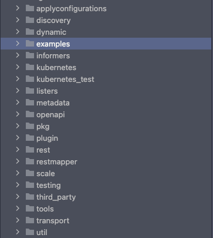
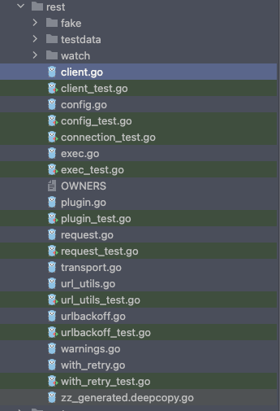

<!--more-->
# Client-go1

> 1. client-go源码学习系列，写到博客中，一为定个小目标监督自己学习，二为留下记录，防止长时间不用某些知识而忘记。
> 2. 本章节是client-go系列的第一个章节，准备将client-go源码学习一边，记录下来。


### 背景：

1. client-go学习的是1.24版本对应k8s `1.24`版本
2. 以前版本没细致的读过不知道1.24版本相较于以前的版本有没有大的变化

### 目录结构：



|  |  |
| --- | --- |
| applyconfigurations | 1.24版本kubernetes中所有资源对象的所有版本的结构体。 |
| discovery | discovery客户端API |
| dynamic | dynamic客户端API |
| informers | 1.24版本kubernetes中所有资源对象的informer实现 |
| kubernetes | clientSet客户端API |
| listers | 1.24版本kubernetes中所有资源对象的所有版本的lister实现 |
| metadata | 用于获取GVR对应的metadata |
| openapi |  |
| pkg |  |
| plugin |  |
| rest | rest客户端API |
| restmapper |  |
| scale | scale客户端API |
| third_party |  |
| tools |  |
| transport |  |
| util |  |

### 本章主旨

<aside>
😅 Client-go rest包阅读

</aside>



<aside>
😅 client-go感觉就是一个k8s工具包集合，提供了各种k8s客户端，阅读rest包，我大体看了下，感觉应该从client.go文件开始。

</aside>

- **client.go**

    ```go
    ## 首先看下NewRESTClient()方法
    方法入参：baseURL *url.URL
    
    ```